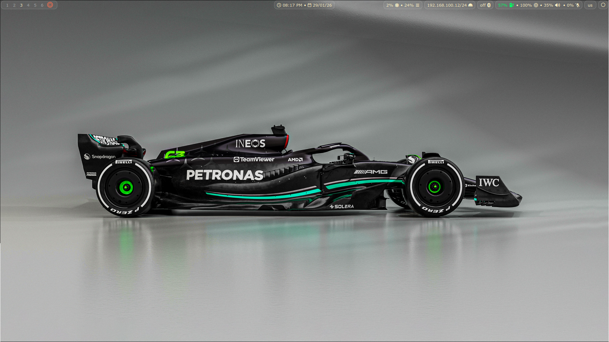
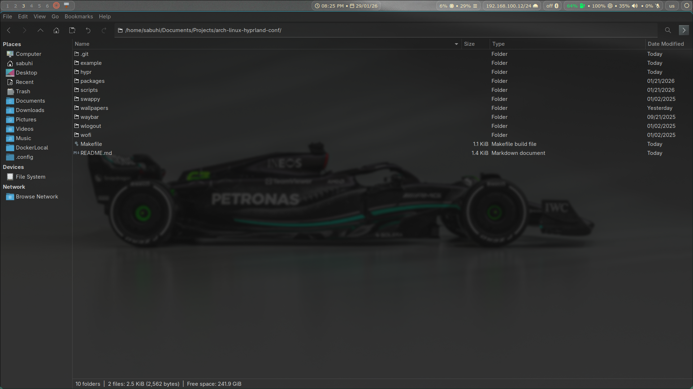
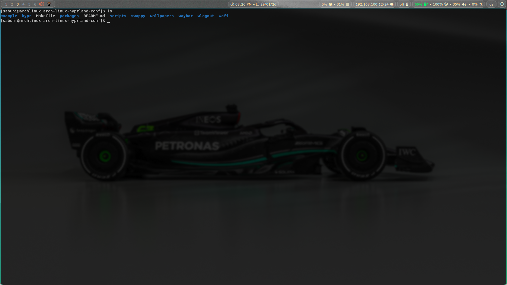
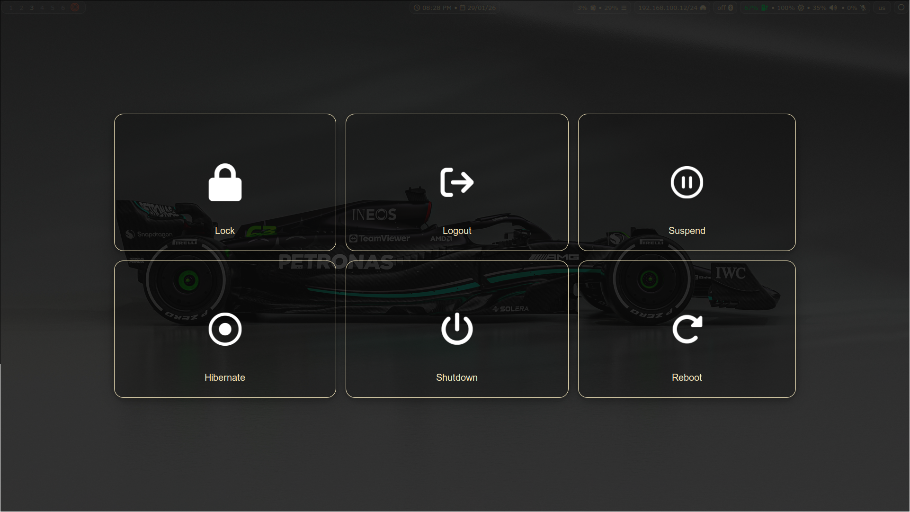

# Configuración de Arch Linux [Hyprland](https://hyprland.org/)

Este repositorio contiene mis configuraciones personales para el entorno de escritorio Hyprland. Incluye configuraciones para diversas herramientas y aplicaciones.

## ✨ ¿Qué es Hyprland?

[](https://github.com/hyprwm/Hyprland)

Hyprland es un compositor Wayland de mosaicos dinámico basado en wlroots que no sacrifica su estética. Ofrece las últimas características de Wayland, es altamente personalizable, tiene todo lo visualmente atractivo, los complementos más potentes, una IPC sencilla, muchas más mejoras de calidad de vida que otros compositores basados en wlr y mucho más...

## 📸 Capturas de pantalla
<p align="center">
  
  
</p>

<p align="center">
  
  
</p>


## 🚀 Cómo empezar

Clona el repositorio en tu máquina local.

```console
git clone https://github.com/alasgarovs/arch-linux-hyprland-conf.git & cd arch-linux-hyprland-conf
```

### 🛠️ Herramientas de configuración, temas, iconos, etc.

Configura el proyecto e instala herramientas, temas, iconos, etc.

```console
# Configura el proyecto
make configure

# Instala paquetes con pacman
make pacman
	
# Instala paquetes con yay
make yay

# Establece el fondo de pantalla de inicio de sesión
make set-login-wallpaper
```
---

## 📝 Nota

Este proyecto se actualiza constantemente con nuevas funciones y mejoras.
